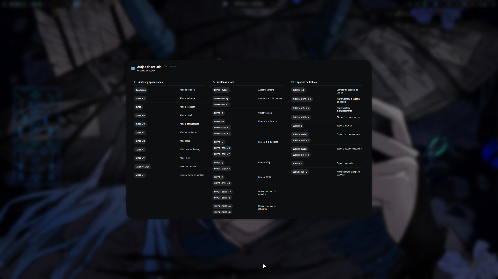

# Ambxst Shortcuts Overlay

<p align="center">
  <strong>Native shortcut reference for Ambxst</strong><br>
  <code>v0.2.0 (release)</code> · <code>Ambxst 1.3.3</code> · <code>mod: kuroflynn.shortcuts-overlay</code> · <code>SUPER + /</code>
</p>



A fast, read-only overlay for checking active keyboard shortcuts without leaving the desktop or opening Ambxst settings.

This repository is the only editable source of truth. The Ambxst source tree is an external inspection and composition target, while dotfiles remain declarative configuration only.

## Highlights

- Ships as a native Ambxst mod (`kuroflynn.shortcuts-overlay`), installed and activated by Ambxst's own mod manager; no `install.sh`/`uninstall.sh` and no new runtime dependency.
- Reads the active `binds.json` dynamically instead of embedding a fixed shortcut list.
- Groups, deduplicates, and compacts shortcuts into a responsive, scrollable layout.
- Follows keyboard focus across monitors and closes with `Esc`.
- Integrates through Ambxst's native theme, overlay, global-state, and mutual-exclusion behavior.
- Only a read-only verifier (`scripts/verify.sh`) and the test suite live in this project; both are non-destructive and never touch the live Ambxst tree.

## Layout

```text
ambxst.mod.json
payload/
    modules/widgets/shortcuts/
        ShortcutsOverlay.qml
        ShortcutData.js
patches/
    ambxst-integration.patch
docs/
    assets/
        shortcut-overlay-view.png
    qa/
        v0.1.1/
        v0.1.0/
scripts/
    verify.sh
tests/
    run.sh
    shortcut-data.test.js
    hardening.test.js
    manifest.test.py
    composition.test.py
    verify.test.sh
    qml.test.py
CHANGELOG.md
```

- `ambxst.mod.json` declares the package: two `overlay` operations for `payload/modules/widgets/shortcuts/` plus one `patch` operation for `patches/ambxst-integration.patch`.
- `payload/` holds the canonical overlay implementation, moved from the former `src/` tree.
- `patches/ambxst-integration.patch` contains only the required changes to Ambxst's shared files.
- `scripts/verify.sh` is a read-only, self-contained package verifier; optional composition runs only in `/tmp`.
- `tests/` validates the manifest, the composition, the adapter, and the overlay without a running Ambxst session.
- `references/` may contain optional local visual references. It is ignored by Git and is never required.

## Native package

The manifest targets Ambxst `1.3.3` (`"ambxst": ">=1.3.3 <1.4.0"`, API 1) and records the tested base commit `af9f8ad4...` in `testedBaseCommits`. It declares no dependencies, conflicts, commands, or settings, and one read-only permission (`Lee la configuración activa de atajos de Ambxst (solo lectura)`). Payment of the permission and the activation flow belong to the Ambxst mod manager (`ambxst mods ...`); this project never runs them itself.

Composition follows the manager's algorithm exactly (base exported from `git archive HEAD` of the activated Ambxst, `git init` with a fixed identity, overlay copies in manifest order, then the patch with a verbatim apply-failure falling back to a three-way merge). The verified base (`af9f8ad4`, tag `1.3.3`) does not contain `modules/widgets/shortcuts/`, so both overlay operations are pure additions and no `replace: true` is used. This declaration is validated by `tests/manifest.test.py` and exercised by `tests/composition.test.py`.

## Target root

`scripts/verify.sh` resolves the Ambxst tree **only** via an explicit argument; there is no automatic resolution (no environment variable, no registry, no fallback directory):

1. `scripts/verify.sh /absolute/path/to/ambxst` → package review + composition in `/tmp`.
2. `scripts/verify.sh --package-only` → package review only, target never consulted.
3. `scripts/verify.sh -h` / `--help` → usage. No arguments (or more than one) is a usage error.

The target path must exist, be absolute, not be `/` or `$HOME`, and be a Git worktree root with the expected Ambxst files; its tree must also carry `docs/mods/manifest.schema.json` byte-identical to the vendored copy. Validation is structural and does not prove provenance: forks remain supported.

## Verify

```bash
scripts/verify.sh --package-only
scripts/verify.sh /path/to/ambxst
```

The verifier is read-only. In both modes it validates the manifest against the vendored `docs/mods/manifest.schema.json` and the manager's runtime checks (`scripts/manifest_validate.py`, JSON-Schema 2020-12 evaluator plus backend parity: no `replace: true` without `expectedSha256`, safe relative paths, no symlinks, sources existing), enforces the fixed package policy (fixed three-operation layout, recorded range and tested base, one read-only permission), checks that every referenced path exists, verifies the patch affects only `modules/services/Visibilities.qml`, `modules/services/GlobalShortcuts.qml`, and `shell.qml`, and applies `bash -n`/`node --check`-style syntax checks through the hardened adapter. With a target argument it additionally composes the mod in `/tmp` via `scripts/compose.py`, handing it an exact, fresh worktree-opaque generation directory (`mktemp -d /tmp/ambxst-shortcuts-overlay.verify.XXXXXX`) it owns and cleans itself — no logs, grep, or patterns are used to locate or wipe the generation. The target is validated with `git rev-parse`, so both plain repos and linked Git worktrees are accepted; an empty target argument is rejected (only `--package-only` omits the destination). The engine preserves git-archive file modes (executables stay `0755`) and refuses a `--3way` failure that leaves no unmerged files. The verifier never writes to the real Ambxst tree.

Static QML analysis uses `/usr/lib/qt6/bin/qmllint` and prints the exact path/version. Outside the running shell, unresolved `qs.*`/Quickshell context warnings can occur; a successful exit checks syntax/static analysis only and never means runtime PASS.

## Tests

```bash
bash tests/run.sh
```

The suite covers `ShortcutData.js` adapter regressions, the manifest validation against the vendored schema (119 checks, including boolean-vs-integer `const` and `propertyNames`/`additionalProperties` without `properties`), manager-style composition (69 checks: base export, overlay copy, dead-hook hardening, three-way-merge fallback, concurrent-insertion resolution, `--3way`-failure abort, executable-mode preservation, linked worktrees, target-read-only enforcement), verify.sh CLI/mutations (18 checks), and a Qt `qmltestrunner` pass for the overlay model. Everything composes and validates only under `/tmp` (the suite never writes under `$HOME` and leaves no `scripts/__pycache__`); the live Ambxst tree is never written.

## Use

Open or close the installed overlay with:

```bash
ambxst run shortcuts
```

The suggested personal bind is `SUPER + /`. It toggles the overlay, while `Esc` closes it from inside the panel. The bind belongs to the user's Ambxst configuration; a mod cannot and must not create, change, or remove it. After removing the mod, remove the personal bind manually if it is no longer wanted.

## Version `v0.2.0`

`v0.2.0` converts the project to a native Ambxst mod. It preserves the v0.1.1 overlay behavior and design: same `ShortcutsOverlay.qml` and `ShortcutData.js` content, same integration patch. The former installer scripts (`install.sh`, `uninstall.sh`, `common.sh`, `gen_candidate`) and their recovery state live on at tag `v0.1.1` and are not part of this release.

Compatibility is declared against Ambxst `>=1.3.3 <1.4.0` and recorded as tested on base `af9f8ad4...` (tag `1.3.3`). The mod composes and the patch applies verbatim on that base; this is checked in `/tmp` by `tests/composition.test.py` and `scripts/verify.sh`. Runtime behavior on a live session (toggle, `Esc`, scrolling, dual-monitor focus, coexistence with other overlays) has **not** been re-validated for a native activation and is the pending runtime validation.

For reference, `docs/qa/v0.1.1/REPORT.md` records the v0.1.1 runtime results (T018 PASS, T019-A/B PASS, T020-1/2/3 PASS, T020-4 NOT EXECUTED, T021-A/B/C PASS) and `docs/qa/v0.1.0/REPORT.md` the v0.1.0 audit. Pre-existing recovery material from v0.1.1 installations (`.ambxst-shortcuts-recovery/`) is intentionally left untouched by this release; its cleanup remains manual.

## Version `v0.1.1`

The previous release was validated on Ambxst `1.2.6`, including real installation, migration, uninstall/reinstall, repeated toggle and `Esc`, scrolling and keyboard navigation, dual-monitor placement, dashboard coexistence, lock/unlock, and suspend/wake. See the v0.1.1 QA report and its design comparison for the transactional installer details. The independent project remains the sole canonical source; the Ambxst tree is only a deployment and runtime-validation target.